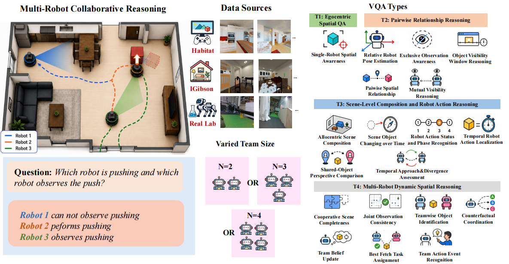

# Seeing Together: Multi-Robot Cooperative Egocentric Spatial Reasoning with MLLMs

<p align="center">
  
</p>

<p align="center">
  <a href="TODO_PAPER_LINK"></a>
  <a href="TODO_PROJECT_PAGE"></a>
  <a href="TODO_DATASET_LINK"></a>
  <a href="TODO_MODEL_LINK"></a>
  <a href="TODO_LICENSE"></a>
</p>

## Seeing Together

**Seeing Together** studies a new embodied AI problem:  
**multi-robot cooperative egocentric spatial reasoning**.

Instead of reasoning from a single camera view, a model must answer questions by integrating synchronized egocentric videos from a team of moving robots. This requires understanding partial observations, cross-robot visibility, inter-robot spatial relations, robot actions, temporal changes, and team-level scene knowledge.

This repository contains the official implementation of:

- **CoopSR**: a benchmark for cooperative multi-robot visual question answering.
- **EgoTeam**: a multi-robot egocentric QA dataset with more than 114K QA pairs.
- **SP-CoR**: a Spectral and Physics-Informed Cooperative Reasoner for multi-robot MLLMs.

---

## Highlights

- **New task**: cooperative spatial reasoning from synchronized multi-robot egocentric videos.
- **Large benchmark**: 114K+ QA pairs across simulated and real-world environments.
- **Rich QA taxonomy**: 19 question types organized into four reasoning tiers.
- **Variable team sizes**: robot teams with `N = 2`, `N = 3`, and `N = 4`.
- **Multi-environment evaluation**: Habitat, iGibson, and real-world quadruped robot scenes.
- **Pose-free inference**: SP-CoR uses pose supervision during training but requires only egocentric videos at test time.
- **Strong performance**: SP-CoR improves over strong fine-tuned MLLM baselines on Habitat, iGibson, cross-team-size, and real-world evaluations.

---

## Benchmark: CoopSR

**CoopSR** evaluates whether multimodal large language models can build a shared understanding of a dynamic environment from multiple robot viewpoints.

The benchmark covers four progressive reasoning levels:

| Tier | Name | Description |
|---|---|---|
| **T1** | Egocentric Spatial QA | Single-robot spatial awareness, including object locations, directions, distances, and local layouts. |
| **T2** | Pairwise Relationship Reasoning | Reasoning about two robots, objects, or viewpoints, including visibility, occlusion, mutual line-of-sight, and pairwise spatial relations. |
| **T3** | Scene-Level Composition and Robot Action Reasoning | Integrating multiple robot views into a coherent scene-level representation, including object changes, action phases, and temporal movement. |
| **T4** | Multi-Robot Dynamic Spatial Reasoning | High-level collaborative reasoning over the full team, including team belief updates, counterfactual coordination, fetch-task assignment, and team action events. |

---

## Dataset: EgoTeam

**EgoTeam** is a multi-robot egocentric QA dataset designed for cooperative embodied reasoning.

| Property | Description |
|---|---|
| QA pairs | 114K+ |
| QA types | 19 |
| Reasoning tiers | 4 |
| Team sizes | 2, 3, and 4 robots |
| Simulators | Habitat and iGibson |
| Real-world test set | Two quadruped robots |
| Inputs | Synchronized egocentric RGB-D videos |
| Metadata | Robot poses, pairwise relative poses, semantic information, object relations, and robot-object interactions |

The dataset supports questions involving:

- object visibility and occlusion,
- mutual robot visibility,
- pairwise robot-object relations,
- shared-object perspective comparison,
- temporal approach and divergence,
- robot action recognition,
- team-level scene completeness,
- team belief updates,
- counterfactual coordination,
- best robot assignment for fetch tasks,
- and multi-robot action event recognition.

---

## Method: SP-CoR

**SP-CoR** stands for **Spectral and Physics-Informed Cooperative Reasoner**.

It is designed to help MLLMs reason over long, redundant, and partially overlapping video streams from multiple robots.

SP-CoR contains three main components.

### 1. Spectral Energy-Aware Multi-Robot Relevant Frame Sampler

Long multi-robot videos contain many redundant frames. SP-CoR first retrieves query-relevant frames and then refines them using temporal frequency energy over visual features.

This allows the model to focus on frames that are both:

- semantically relevant to the question, and
- temporally informative for actions, movement, or visibility changes.

### 2. Spectral and Physics-Informed Multi-Robot Fusion

Naively concatenating robot video streams does not teach the model how robots relate to each other.

SP-CoR instead fuses robot observations using:

- robot identity tokens,
- temporal spectral tokens,
- motion and pose-aware tokens,
- reliability-aware pooling,
- and cross-attention across robot-level visual states.

This helps the model reason about co-visibility, viewpoint conflict, shared objects, and team-level scene structure.

### 3. Physics-Aligned Prompt-Space Distillation

During training, SP-CoR can use simulator or motion-capture pose information as privileged supervision.  
At inference time, however, it does **not** require external localization or ground-truth robot poses.

A pose-aware teacher distills physical priors into student prompt tokens, allowing the final model to reason from egocentric videos alone.

---

## Main Results

SP-CoR achieves state-of-the-art performance on CoopSR across Habitat and iGibson.

| Method | Habitat AVG | iGibson AVG |
|---|---:|---:|
| Best zero-shot MLLM | 41.56 | 41.44 |
| Best SFT baseline | 66.68 | 63.67 |
| Best RAG / keyframe baseline | 65.63 | 63.70 |
| **SP-CoR** | **70.55** | **70.82** |

SP-CoR also improves generalization to unseen team sizes. When trained on `N = 2, 3` robots and evaluated on `N = 4`, SP-CoR achieves the strongest performance across tested backbones.
---

## Dataset Download Link

Sim Videos and sim+real QAs

[KPeng9510/EgoTeam](https://huggingface.co/datasets/KPeng9510/EgoTeam/tree/main)

Realworld videos

[Download Link](https://pan.baidu.com/s/1FwRh9foJu78qII4E5X7Fvg?pwd=r689)

---

## Installation

```bash
git clone https://github.com/TODO_ORG/seeing-together.git
cd seeing-together

conda create -n seeing-together python=3.10
conda activate seeing-together

pip install -r requirements.txt
